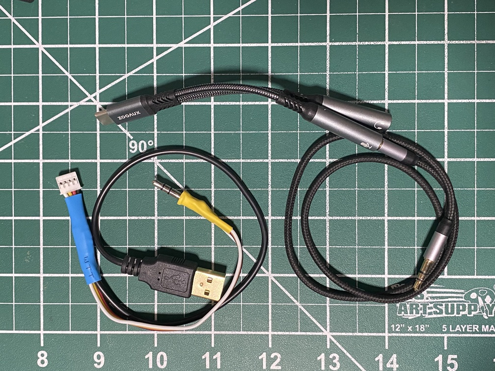

# QC705 — A Self-Contained IC-705 WiFi FT8 Client

QC705 is a fork of Wei (AG6AQ)'s **Mini-FT8**, and it stands entirely on the
shoulders of that work — Karlis Goba's [ft8_lib](https://github.com/kgoba/ft8_lib),
the audio/DSP and autoseq foundation from Zhenxing (N6HAN), and the inspiration
of the DX-FT8 team. **All credit for the original application belongs to them.**

Where Mini-FT8 drives QMX/QDX/KH1 radios over a serial/USB-audio path, **QC705
has a completely different aim**: it turns the Cardputer ADV into a *standalone
wireless FT8 station for the Icom IC-705* — CAT control, receive-audio decode,
and transmit, all over WiFi, with **no PC, no soundcard, and no audio cables**.
The IC-705's own WLAN server is the only link. In doing so it pushes the
ESP32-S3 Cardputer ADV (which has **no PSRAM**) well past what the platform was
expected to do.

## Challenges overcome to make FT8 work with the IC-705 over WiFi

- **Implementing the Icom WLAN remote protocol on a microcontroller** — the same
  control / CI-V-serial / audio UDP streams used by RS-BA1, wfview, and
  kappanhang: SID handshakes, login + authentication, tracked sequence numbers,
  and pkt7 keepalives, all on a tiny embedded stack.
- **The login token window** — a few hundred milliseconds of delay before the
  login packet silently poisoned the radio's token and broke the handshake; the
  connect sequence had to be made delay-free.
- **No PSRAM (~512 KB SRAM total)** — fitting the entire FT8 decode pipeline
  *plus* the WiFi stack *plus* live audio streaming into internal RAM, including
  trimming decode oversampling and converting buffers to static allocation.
- **Smooth receive audio over WiFi** — a dynamically-allocated audio queue was
  silently failing to allocate and dropping every sample; moving to a static
  queue, plus a watchdog-safe yield, restored continuous RX.
- **Keeping the 15-second FT8 window aligned without a PC** — locking timing to
  GPS UTC and re-anchoring the decode window after each synchronous decode so
  decodes stopped drifting out of the slot.
- **Clean, constant-envelope transmit over WiFi** — pacing TX with a hardware
  timer matched to the radio's *measured* sample clock to eliminate buffer
  drift, and gating the protocol's idle keepalive (kept flowing during RX for
  smooth audio, suppressed during TX) to stop the carrier from pumping and
  splattering.
- **Transmit under memory pressure** — WiFi `send()` buffer exhaustion on the
  no-PSRAM board was dropping TX audio; static TX buffers and disabling A-MPDU
  TX aggregation got delivery clean.
- **CI-V quirks** — fixing an unintended filter clobber and adding handshake
  retries so CAT control comes up reliably.
- **Durable logging with no serial console** — QSO records are fsync'd straight
  to the SD card and the mount is pinned for the session, so a pulled card keeps
  every contact; storage health is reported on the device's own screen.

## New features and menu changes (vs. Mini-FT8)

- **IC-705 over WiFi** as a first-class radio target — CAT, RX decode, and TX
  all run over the radio's WLAN connection instead of a serial/USB-audio path.
- **No external audio hardware** — the soundcard/USB-C-audio-adapter and audio
  cabling that other radios require are gone; the WiFi audio stream replaces them.
- **On-device SD-logging status** surfaced in the QSO (`Q`) view — mount state
  and per-QSO write results, since the board has no serial console.
- **On-device RX-health / TX diagnostics** for tuning link quality in the field.
- **Streamlined to the IC-705 target** — the KH1-specific CAT/diagnostic keys
  were removed to keep the build focused on the wireless IC-705 use case.

> QC705 is an experimental, boundary-pushing build. Huge thanks again to the
> Mini-FT8 authors — this project exists only because of the foundation they
> shared with the community.

---

# Mini-FT8 Operation Manual

## Quick Mode Map

| Key | Mode | Purpose |
|---|---|---|
| `R` | RX | View decoded messages and tap one to start a QSO. |
| `T` | TX Queue | View and manage the transmit queue. |
| `S` | STATUS | Access beacon, connect/sync, band step, tune, and date/time functions. |
| `G` | GPS | View GPS telemetry and synchronization status. |
| `M` | MENU P1 | Configure core station and operator settings. |
| `N` | MENU P2 | Configure radio, input, and comment settings. |
| `O` | MENU P3 | Configure logging, active bands, GNSS LoRa GPS, copy-to-SD, and retry settings. |
| `Q` | QSO | Browse QSO and log files, and view entries. |
| `D` | Delete Files | Browse and delete files stored in internal FATFS. |
| `B` | BAND | Edit per-band frequencies. |
| `C` | USB Drive | Toggle internal FATFS ownership between Mini-FT8 and the PC. |
| `P` | Performance | View A Simple Performance Monitor. (added in V2.0.4)|

## Global Keys and Navigation

- `R` / `T` / `B` / `S` / `G` / `Q` / `D` / `C`: switch to the selected mode. Press the same mode key again to return to `RX`.
- `M` / `N` / `O`: jump to MENU page 1 / 2 / 3. Press the current page key again to return to `RX`.
- `` ` ``: cancel TX globally in `RX`, `TX`, and `STATUS` when not editing.
- `▲` / `▼`: page up / page down in `RX`, `TX`, `BAND`, `MENU`, `QSO`, and `Delete`.
- `◀` / `▶`: move left / right in `QSO-SNR`, `STATUS` date/time, `MENU P2` (N->2).
- `1`..`6`: always select the currently visible row in the active mode.

## Per-Mode Controls

- ` acts as ESC where applicable.
- Text Edit: Backspace deletes, ` cancels, Enter saves.
  
| Mode | Item | Notes |
|---|---|---|
| `R` (RX) | `1..6` | Select a decoded line to reply to. CQ messages are sorted from strongest to weakest. If selected within 4 s, TX starts immediately. |
|  | `▲` `▼` | Page up/down is available when line 1 or line 6 is cyan. |
| `T` (TX Queue) | `1` | Rotate the queue to the next same-parity entry. |
|  | `2..6` | Drop the queue item on the current page. |
|  | `` ` `` | Cancel TX immediately. |
| `G` (GPS) |  | View live GPS telemetry including active source, 3D fix, satellites, UTC time, grid square, and last synchronization age. |
| `S` (STATUS) | `1` | Cycle Beacon mode. Applies when leaving STATUS mode. |
|  | `2` | Run connect/sync now; starts audio and follows the CAT sync path. |
|  | `3` | Step to the next active band. Applies after key 2 is pressed or when leaving STATUS. |
|  | `4` | Toggle Tune. |
|  | `5` | Edit Date (in place). On the Time line, `G` means GPS time and `R` means DS3231 RTC time. |
|  | `6` | Edit Time (in place). |
| `M` (MENU P1) | `1` | Cycle CQ Type. For CQ FD, enter operating class and ARRL/RAC section in FreeText, for example `1B SCV`. |
|  | `2` | Send FreeText once. |
|  | `3` | Edit FreeText (Long Edit). Used for SOTAMAT, park/summit reference, ARRL Field Day exchange, CQ modifiers (`CQ EU`, `CQ ASIA`), and similar text. |
|  | `4` | Edit Call (in place). |
|  | `5` | Edit Grid (in place). Supports 4/6/8-character grid. If GPS is available, the GPS grid is shown and used, but not saved. |
|  | `6` | Enter Sleep. Shows battery info. |
| `N` (MENU P2) | `1` | Select offset source: Random / RX / Fixed. Random values are within 500-2500 Hz. |
|  | `2` | Edit fixed cursor offset (in place). Enter directly or use `▲` `▼` `◀` `▶`. |
|  | `3` | Select radio (`QMX` / `QDX` / `KH1-USBC` / `KH1-MIC`). |
|  | `4` | Edit ignore list (Long Edit). Prefixes are separated by spaces; maximum 64 characters. |
|  | `5` | Edit comment (Long Edit). Used for ADIF logging. Supports `/Radio` and `/Grid` macro expansion. |
|  | `6` | Select FT8 / FT4 protocol. Reboot to apply the change. |
| `O` (MENU P3) | `1` | Turn RxTx log on/off. Note: RxTxLog has been renamed to `RT[YYMMDD].txt`. |
|  | `2` | Turn SkipTX1 on/off. Skips `dxcall mycall mygrid` and replies with the SNR report. |
|  | `3` | Edit active bands (Long Edit). Used by STATUS -> Band. |
|  | `4` | Toggle `GNSS_LoRa`. `OFF` uses PORTA GPS; `ON` uses the LoRa-1262 cap GNSS. |
|  | `5` | Copy files to SD. Feedback is `Copied OK` or `Missed [n]`. |
|  | `6` | Edit max retry (in place). Accepts any natural number or `0`. |
| `Q` (QSO) | `1..6` | Open the selected ADIF file. |
|  | `◀` `▶` | Switch columns (Default view or SNR view). |
| `D` (Delete Files) | `1..6` | Delete the selected file immediately, without confirmation. |
| `B` (BAND) | `1..6` | Choose a band slot to edit. |
| `C` (USB Drive) |  | Stop radio audio and expose FATFS to the PC. Safely eject it on the PC, then press `C` again to remount storage and return to RX. |
| `P` (PERFORMANCE) | | A Simple Performance Monitor. (added in V2.0.4) |

## Download Logs

- Mini-FT8 and Mini-CW share the `fatfs` partition. Their files can coexist,
  and current M5Launcher installs/reinstalls can switch between the applications
  while preserving an existing compatible FATFS partition. Both applications
  use 512-byte FATFS and wear-levelling sectors.

- Use SD
  - Insert a FAT/FAT32-formatted SD card.
  - In MENU P3 (`O`), press `5` (Copy files to SD). All files will be copied to the SD card.
  - If the result shows `Missed`, a reboot will usually fix it.

## GPS Connections

Mini-FT8 supports two GPS sources selected from MENU P3 (`O -> 4`):

- `GNSS_LoRa:OFF` uses the PORTA GPS wiring below. Both 9600 and 115200 baud GPS modules are supported and auto-detected. **Make sure the micro switch is on the left.** Once Mini-FT8 gets its time/grid, the GPS can be removed, this is important for KH1.
- `GNSS_LoRa:ON` uses the M5Stack LoRa-1262 cap GNSS on UART2 (`RX=G15`, `TX=G13`) at 115200 baud. The LoRa/SX1262 radio side is not used. This source can keep running while KH1 CAT uses PORTA/UART1.

When `GNSS_LoRa` is `ON`, the physical G4/G5 debug UART path is disabled and the pins are left as floating inputs to avoid conflicts. USB Serial/JTAG host commands still work.

The GPS view shows the active source on its first line.
```text
┌──────────────────┐                 ┌─────────────────────────────┐
│ GPS              │                 │ Cardputer ADV               │
│                  │                 │ PORTA                       │
│ GND ─────────────┼─────────────────┤ GND                         │
│ VDD ─────────────┼─────────────────┤ 5V                          │
│ RX  ─────────────┼<──(Not Used)────┤ TX (G2)                     │
│ TX  ─────────────┼────────────────>┤ RX (G1)                     │
└──────────────────┘                 │                             │
                                     │ SW: 5VOUT (Left)            │
                                     └─────────────────────────────┘
```

## DS3231 RTC Connections

Mini-FT8 can use an optional DS3231 module as an external UTC clock. Connect it
to the Cardputer Adv shared I2C bus: `SDA=G8`, `SCL=G9`, plus module power and
ground. On boot, a valid DS3231 time is used before the ESP RTC or saved
`Station.txt` time. Status `S -> 6` appends `R` when the active time came from
the DS3231, and appends `G` after a full GPS time sync. GPS and manual time
updates write the DS3231 when it is present; FT8 decode fine corrections do not.

## KH1 Connections


 - TX Only ([sotamat](https://sotamat.com/))
```text
┌──────────────────┐                 ┌────────────────────────────┐
│ KH1 RS232        │                 │ Cardputer ADV              │
│                  │                 │ PORTA                      │
│ GND ─────────────┼─────────────────┤ GND                        │
│                  │                 │ 5V (NC)                    │
│ Tip(Rx) ─────────┼<────────────────┤ TX (G2)                    │
│ Ring(TX) ────────┼───(Not Used)───>┤ RX (G1)                    │
└──────────────────┘                 │                            │
                                     │ SW: NA                     │
                                     └────────────────────────────┘
```
- TX + RX (FT8/FT4 QSO)
  - Choose `KH1-USBC` for USB-C audio adapter RX. Tested adapter: Amazon `B0FWC9ZFC4`. Other adapters may also work, but this one is confirmed.
  - Choose `KH1-MIC` for Cardputer microphone RX. No USB-C audio adapter is needed.
  - For `KH1-USBC`, supply 5 V to PORTA; otherwise, the USB-C OTG port will not be powered. **Make sure the micro switch is on the right**
```text
┌──────────────────┐
│ Power Cable      │
│ GND ─────────────┼─────────┐
│ 5V  ─────────────┼─────┐   │
└──────────────────┘     |   |
┌──────────────────┐     |   |       ┌────────────────────────────┐
│ KH1 RS232        │     |   |       │ Cardputer ADV              │
│                  │     |   |       │ PORTA                      │
│ GND ─────────────┼─────)───┴───────┤ GND                        │
│                  │     └───────────┤ 5V                         │
│ Tip(Rx) ─────────┼<────────────────┤ TX (G2)                    │
│ Ring(TX) ────────┼── (Not Used)───>┤ RX (G1)                    │
└──────────────────┘                 │                            │
                                     │ SW: 5VIN (Right)           │
                                     └────────────────────────────┘
```

- Mini-FT8 automatically sets KH1 TX power to 2 W.
- For best RX performance, reduce AF volume to `05` or `06`.
